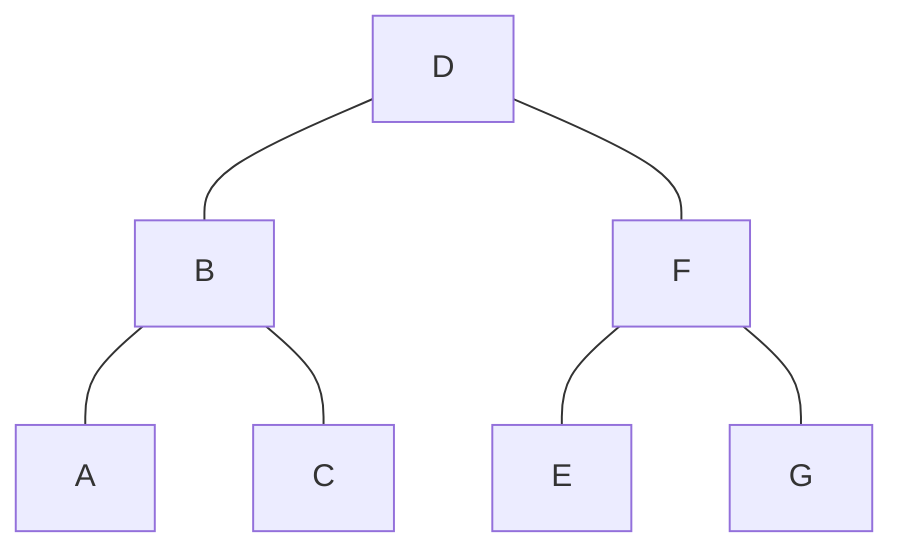

# 树

树是一种特殊的图：唯一起始顶点，其余顶点仅有一个前驱节点；
-   二叉树：每个节点有两个子树；
-   多叉树：每个节点可能存在多个子树；

## 二叉树

按照对二叉树的要求，从严格到宽松，可以对二叉树进行分类，拥有不同的特性；

### 满二叉树

### 完全二叉树(Heap)
1、左右子树最大高度差为1，即：除去最后一层节点为一棵满二叉树；
2、最后一层节点需从左到右分布；

堆：增加排序的完全二叉树，极值节点永远在根节点；
-   MaxHeap：每个节点的值大于子节点；
-   MinHeap：每个节点值小于子节点；

### 平衡二叉树
要求：左右子树最大高度差为1，即：除去最后一层节点为一棵满二叉树；
不要求节点分布顺序；

AVL树(自平衡二叉树)：当插入节点导致不平衡，通过左旋/右旋来保持平衡的二叉树；使得查询操作的复杂度稳定；
- 红黑树就是一棵AVL树；

## 多叉树

### Trie/Patricia Tree
`Trie树`：按照字典顺序，特化的多叉树；
- 将单词结尾标记为根节点(图中红色节点)
- 单纯的Trie每个节点保存一个字符，空间浪费，查找效率较低；

`Patricia Tree`：对Trie进行路径压缩后的字典树；
- 当出现某路径只有叶子节点，则进行合并；根节点单独一个字符；
- 节省空间，降低节点数量；
- 增加了插入的复杂度，插入时需要判断是否能够压缩；
- 当数据比较==稀疏==，数据之间重复占比很少，适合构建Patricia Tree；
	- 分叉的地方比较少，就比较稀疏，适合压缩成一个节点；
	- 每个字母都出现分叉，就不适合进行路径压缩；

### B-Tree

B-Tree可以有更低的树高，查找效率更高；
但B-Tree有个很问题，**叶子节点不包含所有值**；
1、范围查找需要回溯；
2、同一个范围，可能涉及多个节点，这意味着可能会执行更多的IO；

### B+Tree

了解到前两个结构的痛点，再看B+Tree的特点：
1、**B+树的叶子节点包含全量索引**；意味着范围查询不需要回溯
2、B+树的叶子节点间是顺序关联的；
3、**顺序增加数据，是最高效的**；

### 哈希树(Merkle Tree)

## 二叉树的遍历

前序遍历：根 → 左 → 右

中序遍历：左 → 根 → 右

后序遍历：左 → 右 → 根

## 根据序列恢复二叉树
可以恢复唯一二叉树的序列必须满足两个条件：

1、至少两个序列；

2、两个序列中，必须有一个中序序列；

### 中序 + 前序
前序 D B A C F E G（根→左→右）
中序 A B C D E F G（左→根→右）

1、首先前序中第一个是D，D是根节点；再分割中序：ABC D EFG
- ABC是D的左子树
- EFG是D的右子树

2、左子树的前序：BAC，B是根节点；
左子树的中序是：ABC，说明A是B的左子树，C是B的右子树；

3、右子树前序：FEG，F是根节点；
中序是：EFG，说明E是左子树，G是右子树；

### 中序 + 后序

