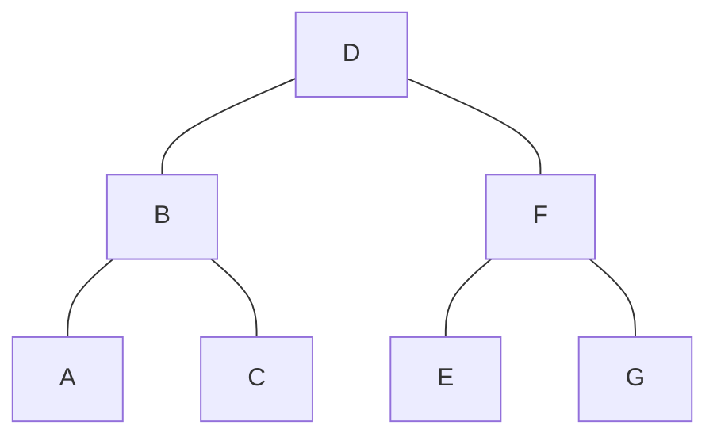

# 树

## 二叉树的遍历

前序遍历：根 → 左 → 右

中序遍历：左 → 根 → 右

后序遍历：左 → 右 → 根

## 根据序列恢复二叉树
可以恢复唯一二叉树的序列必须满足两个条件：
- 至少两个序列；
- 两个序列中，必须有一个中序序列；

### 中序 + 前序
前序 D B A C F E G（根→左→右）

中序 A B C D E F G（左→根→右）

1、首先前序中第一个是D，D是根节点；再分割中序：ABC D EFG
- ABC是D的左子树
- EFG是D的右子树

2、左子树的前序：BAC，B是根节点；
- 左子树的中序是：ABC，说明A是B的左子树，C是B的右子树；

3、右子树前序：FEG，F是根节点；
- 中序是：EFG，说明E是左子树，G是右子树；


### 中序 + 后序


## 相同树/子树
- 判断是否为相同的树
- 判断是否为子树：对主树每个节点，执行一次判断；
```java
public boolean isSameTree(TreeNode p, TreeNode q) {

    if (p==null&&q==null)
        return true;

    if (p != null && q != null && p.val == q.val) {
        if (isSameTree(p.left, q.left) && isSameTree(p.right, q.right))
            return true;
    }

    return false;
}
```

## 对称二叉树

```java
public boolean isSymmetric(TreeNode root) {
    return match(root,root);
}

private boolean match(TreeNode left, TreeNode right) {
    if (left == null && right == null)
        return true;
    
	if (left == null || right == null)
        return false;
    
    return left.val == right.val && match(left.left, right.right) && match(left.right, right.left);
}
```
## 平衡二叉树
```java
public class Solution {

    boolean res = true;

    public boolean isBalanced(TreeNode root) {
        search(root);
        return res;
    }
    private int search(TreeNode root) {
        if (root == null || !res) // 终止
			return 0;

        int left = search(root.left) + 1;
        int right = search(root.right) + 1;

        if (Math.abs(right - left) > 1) 
			res = false;
        
		return Math.max(left, right);
    }
}
```

## 最大最小深度

```java
public int maxDepth(TreeNode root) {
    if (root == null) return 0;
    int leftDepth = maxDepth(root.left) + 1;
    int rightDepth = maxDepth(root.right) + 1;
    return Math.max(leftDepth, rightDepth);
}
```

```java
public int minDepth(TreeNode root) {
    if (root == null) {
        return 0;
    }
    int left = minDepth(root.left);
    int right = minDepth(root.right);

    if (left == 0)    // 表明当前节点，左树为空，直接返回右树深度
        return right + 1;

    if (right == 0)
        return left + 1;
    
    return Math.min(left, right) + 1;
}
```

## 树的公共祖先

```java
public TreeNode lowestCommonAncestor(TreeNode root, TreeNode p, TreeNode q) {
	if (root == null) {
		return null;
	}
	if (root == p || root == q) {	
		return root;
	}
	TreeNode left = lowestCommonAncestor(root.left, p, q);
	TreeNode right = lowestCommonAncestor(root.right, p, q);
	if (left != null && right != null) {	// 说明左右子树各存在一个节点
		return root;
	}
	return left != null ? left : right;	// 全在左树 或 全在右树
}
```
